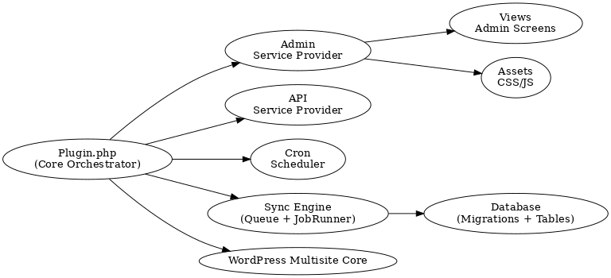

# Multisite Content Sync Engine

A WordPress plugin designed for enterprise-scale multisite deployments, enabling controlled content replication across a network with queued sync jobs, ACF/meta/media mapping, and automation hooks.

This project was built as a senior-level portfolio example demonstrating scalable architecture, object-oriented WordPress development, and multisite-aware systems engineering.

---

## Purpose

Organizations running multiple interconnected sites (franchises, medical groups, SaaS microsites, regional multi-location brands) face significant operational friction when keeping content in sync. Updating individual pages, pricing, services, or policy information across many installations is time-consuming, error-prone, and has no audit trail.

This plugin introduces a central source-of-truth model where selected content can be distributed to target locations through a controlled and trackable workflow.

---

## Current Features (MVP)

- Multisite-only plugin bootstrap
- Network admin UI (Dashboard, Sync Now, Settings)
- Namespaced OOP architecture (`RID\MultisiteContentSync`)
- Service provider pattern for modular load (Admin, API, Cron)
- Separation of logic and presentation (admin views in `/views`)
- Admin CSS/JS asset bundling support

---

## Roadmap (High-Level)

| Upcoming Component | Description |
|-------------------|-------------|
| Manual sync workflow | Select a source site and push content to target sites |
| Database-backed job queue | Async content processing to avoid timeouts |
| Schema migrations | `mcs_jobs` and `mcs_logs` tables with version tracking |
| Media synchronization | Media copying and attachment rewriting across blogs |
| ACF meta field sync | Optional syncing of ACF postmeta and field groups |
| WP-CLI integration | `wp mcs sync` command for automation |
| REST endpoint suite | Trigger syncs programmatically or from CI pipelines |
| Rollback / versioning | Ability to revert content to previous state |
| Selective sync rules | Include/exclude post types, taxonomies, and field groups |

---

## Architecture Overview

```text
src/
├─ Plugin.php
├─ Admin/
├─ API/
├─ Cron/
├─ Services/
├─ Database/
├─ Sync/
└─ Views/
```


Architecture diagram:



---

## Development Setup

Clone and install locally:

```bash
git clone git@github.com:Riley-I/Multisite-content-sync-engine.git
cd Multisite-content-sync-engine
composer install   # optional, for future class autoloading or tooling 
```

Activate on a WordPress multisite:

```bash 
wp plugin activate multisite-content-sync-engine --network
```

Author:

Riley Inniss
Web Developer and UX/UI Designer
https://rileyidesign.ca
